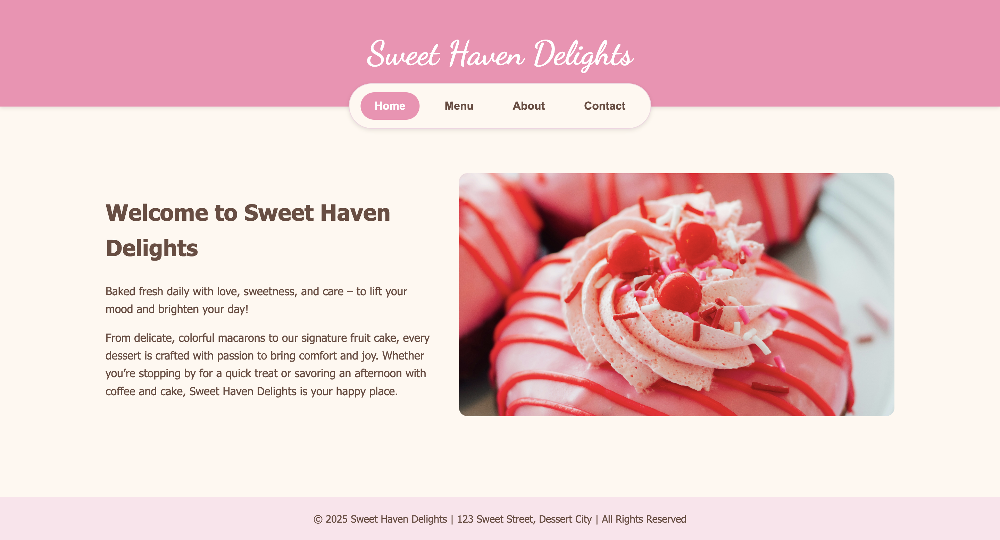
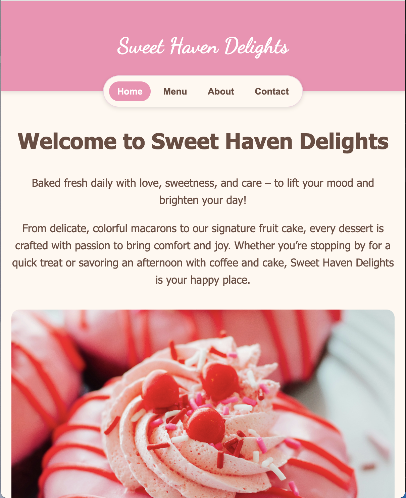
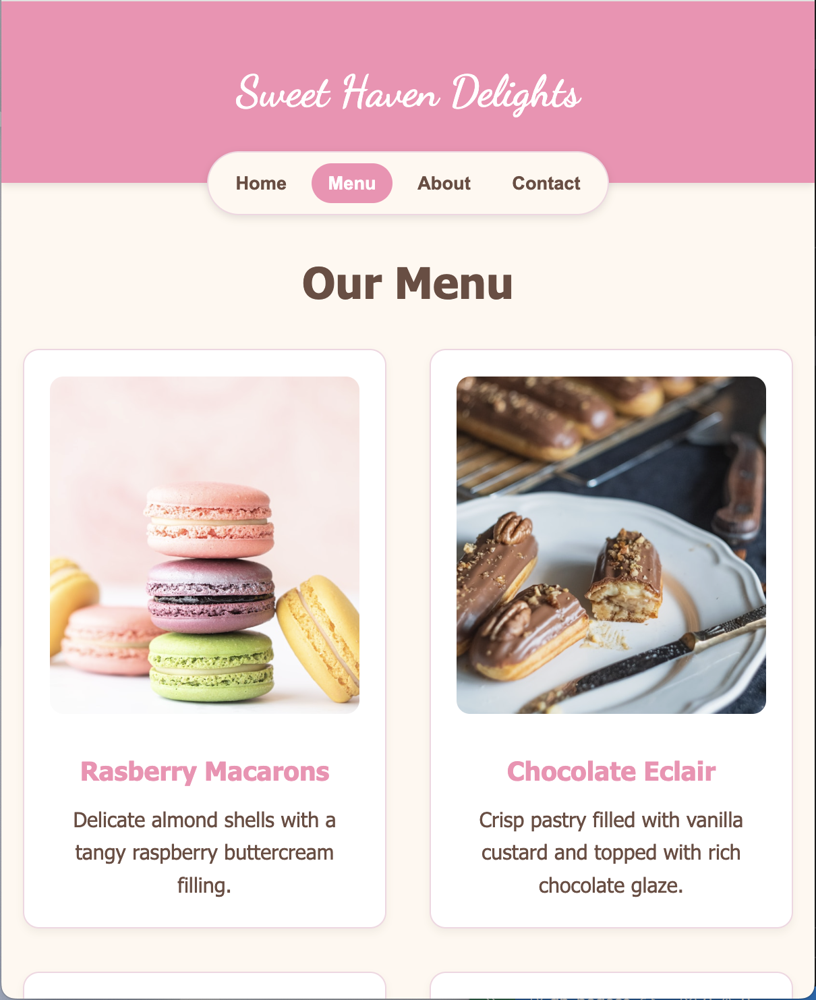

# Sweet Haven Delights Cafe

A simple dessert cafe website built for practice, featuring a responsive design and multi-page navigation (Home, Menu, About, Contact).

Built with:
- **HTML, CSS and JavaScript**
- **Webpack** for bundling
- **GitHub Pages** for deployment

## Features
- Responsive navigation bar with active state
- Image placeholders for menu items and café visuals
- Contact page with location, hours, and styled info cards
- Sweet pink-and-cream color theme

## Live Demo

Check out the live site here:
[Live Demo](https://ni-ki-web.github.io/restaurant-page/)

## Screenshots
- **Home Page**  
  
  

- **Menu Page**  
  
